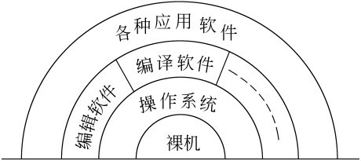
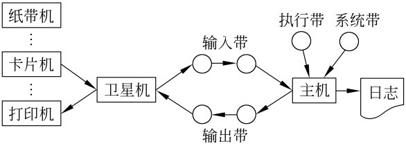
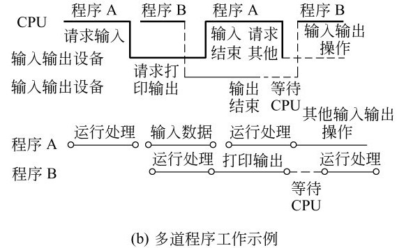
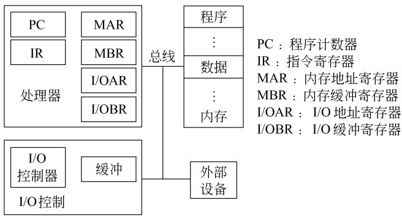
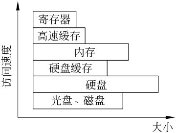
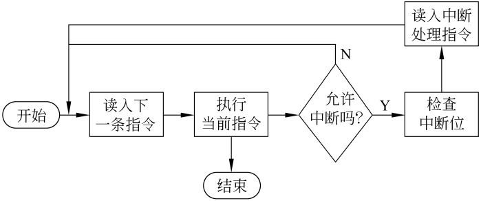

%%%%%%%%%%%%%%%%%%%%%%%%%%%%%%%%%%%%%%%%%%%%
%  PPT头
title: 操作系统
subtitle: 绪论
author: 丘文峰 
%%%%%%%%%%%%%%%%%%%%%%%%%%%%%%%%%%%%%%%%%%%%

1.1 操作系统概念
===============

### 计算机系统 

计算机系统由两部分组成：硬件和软件。计算机硬件通常是由中央处理机（运算器和控制器）、存储器、输入设备和输出设备等部件组成。

### 计算机软件

- 系统软件： 操作系统、多种语言处理程序（汇编和编译程序等）、连接装配程序、系统实用程序、多种工具软件等；

- 应用软件为应用编制的程序， APP

1.1 操作系统概念
===============

### 裸机与虚拟机（bare machine & virtual machine)

1.1 操作系统的三个视角
====================

### 用户、系统管理员、发展

- 用户： 计算机是为用户提供服务的，操作系统为用户提供友好的人机交互

- 系统管理员： 为了合理地组织计算机工作流程，管理和分配计算机系统硬件及软件资源，操作系统是计算机的管理者

- 发展的观点看： 为了给计算机系统的功能扩展提供支撑写着台，使之在追加新的服务和功能时更加容易和不影响原有的服务与功能

1.2 操作系统的历史
================

### 计算机发展的历程

- 1946年至20世纪50年代末 第一代， 电子管时代， 人工操作阶段
- 20世纪50年代末至20世已60年代中期 第二代， 晶体管时代， 批处理系统
- 20世纪60年代中期至20世70年代中期 第三代 集成电路时代， 多道程序设计
- 20世纪70年代中期至20世纪末 第四代， 大规模和超大规模集成电路时代，分时系统
- 21世纪初至今， 以移动、分布和网络计算为代表向
	* 普适计算
	* 网格计算
	* 巨型、微型、并行、分布、网络化、智能化和生物信息化几个方面发展

### 操作系统的发展过程

手工操作阶段 → 批处理系统 → 多道程序系统 → 分时系统 → 实时系统 → 通用操作系统 → 网络操作系统

1.2.1 手工操作阶段
================

### 特点
 - 主要元器件是电子管
 - 计算机速度慢, 几千次/秒
 - 没有操作系统
 - 程序独占资源
 - 上机为手工操作

### 问题
  
随着计算机速度的提高，手工操作的慢速度与计算机高速度之间形成矛盾，成为性能瓶颈

1.2.2 早期批处理系统
==================

### 解决方案

- 配备专门的计算机操作员，减少操作机器的错误 
- 进行批处理， 由监督程序（monitor）自动依次处理

### 早期批处理的两种方式

- 联机批处理： 解决了作业自动转接，但是慢速的输入输出设备和快速主机之间处理串行工作，CPU仍有大量浪费

- 脱机批处理： 增加一台不与主机直接相连而专门用于与输入输出设备打交道的卫星机。

1.2.2  脱机批处理
================

### 卫星机的功能

- 输入设备通过它把作业输入到输入磁带
- 输出磁带将作业执行地果输出到输出设备

### 批处理促进软件发展

- 监督程序， 汇编程序， 编译程序， 连接装配程序， 程序库
- 程序覆盖技术

1.2.2 监督程序的解题过程
====================== 

1.2.2 批处理的优缺点
==================

### 优点

实现了作业的自动过渡，改善了主机CPU和输入输出设备使用情况，提高了计算机系统的处理能力

### 缺点

磁带需人工拆装， 既麻烦又易出错，需要专门的系统维护

1.2.2 执行系统 - 硬件促进软件革新
==============================

20世纪60年代初期， 硬件获得了两方面的进展，导致操作系统进入执行系统阶段。

### 通道

- 专门处理部件， 用于控制一台或多台输入输出设备工作
- 独立于CPU运行

### 中断

- 中断是指当主机接到外部信号（如输入输出设备完成信号）时， 马上停止原来工作，转去处理这一件事件，处理完毕后，主机回到原来的断点继续工作

### 执行系统

- 负责作业运行的自动调度，并提供输入输出控制功能。

- 输入输出联机操作，但是可以并行操作， 系统执行不需要人工干预，从而提高系统的安全性

- 成功案例： FMS, IBSYS。

### 问题

仍然是单道处理， 对于不同类型（计算密集型和IO密集型）的作业，存在资源的浪费

1.2.3 多道程序系统
=================

1.2.3 多道程序运行的特点
======================

### 概念

- 根据作业对资源的要求和一定调度的原则，调若干个作业进入内存，让作业交替运行，以提高系统的资源利用率

### 特点

- 内存中同时存放多个程序
- 宏观上并行
- 微观上串行

### 技术难点

- 同步与互斥问题
- 内存管理， 以提高作业进入内存的道数
- 内存保护

1.2.4 分时操作系统
================

### 分时技术

所谓分时技术， 就是把处理机的运行时间分成很短的时间片，按时间片轮流把处理机分配给各联机作业使用

### 多用户分时操作系统是当今计算机操作系统中最普遍使用的一类操作系统。

1.2.5 实时操作系统
=================

### 特征

- 以在允许时间范围之内（截止时间）做出响应为特征

### 要求

- 计算机对于外来信息能以足够快的速度进行处理，并在被控对象允许时间范围内做出快速响应，其响应时间要求在秒级，毫秒级甚至微秒级或更小

1.2.6 通用操作系统
================

### 概念

- 同时兼有多道批处理、分时、实时处理的功能，或其中两种以上的功能。

### 典型通用操作系统

- 实时批处理系统， 保证优先处理任务，插空进行批作业处理
- 分时批处理系统， 保证分时用户的前提下，进行批量作业处理

### Unix 操作系统是一个通用的多用户分时交互型操作系统

1.2.7 操作系统的进一步发展
=======================

- 个人计算机上的操作系统， 例如 Windows操作系统系列
- 嵌入式操作系统， 例如 Symbian操作系统
- 网络操作系统
- 分布式操作系统
- 智能化操作系统

1.3 操作系统的基本类型
====================

- 批处理操作系统（batch proccessing operating system）
- 分时操作系统（time sharing operationg system）
- 实时操作系统（real time operating system）
- 个人计算机操作系统（personal computer operating syetem）
- 网络操作系统（network operating system）
- 分布式操作系统（distributed opertating system）

1.3.1 批处理操作系统
===================

### 批处理系统的主要特征

- 用户脱机使用计算机
- 成批处理
- 多道程序运行

1.3.1 批处理操作系统优缺点
=======================

### 优点

- 资源共享
- 作业调度
- 以牺牲交互来提高资源的利用率和作业吞吐量

### 缺点

- 无交互性
- 作业周转时间长

1.3.2 分时系统
=============

采用时间片轮转的方式，使一台计算机为多个终端用户服务。

### 特点
- 交互性
- 多用户同时性
- 独立性

### 分时操作系统是一种联机的（on-line）多用户（multi-user）交互式（interactive）的操作系统

- UNIX
- CTSS
- MUTICS

1.3.3 实时系统
=============

### 特点

- 即时响应
- 高可靠性

### 缺点： 资源利用率可能较低

### 设计考虑因素

- 实时时钟管理（定时处理和延时处理）
- 连续的人-机对话
- 过载保护
- 采用冗余措施来保证高度可靠性和安全性

1.3.4 通用操作系统
================

批处理系统，分时系统和实时系统是操作系统的三种基本类型。在此基础上又发展了具有多种类型操作特征的操作，称为通用操作系统。它可以同时兼有批处理、分时、实时处理和多重处理的功能，或其中两种以上的功能

1.3.5 个人PC机上的操作系统
========================

### 特点

- 联机的交互式单用户操作系统
- 相对多用户和分时所要求的处理机调度和存储保护方面要简单得多
- 人机交互是此类型操作系统的重点
- 多媒体功能

### 目前在个人计算机上使用的操作系统以Windows系列和Linux系列为主

1.3.6 网络操作系统
================

在原来计算机操作系统的基础，按照网络体系结构的各个协议标准进行开发，包括网络管理、通信、资源共享、系统安全和多种网络应用服务等。

### 现代操作系统主要特征已包含网络功能，因此不再特指某个操作系统为网络操作系统

1.3.7 分布式操作系统
==================

### 概念

通过通信网络将物理上分布的具有自治功能的数据处理系统或计算机系统互联起来，实现信息交换和资源共享，协作完成任务。

### 特点

- 分布式系统不一定有标准的协议
- 分布式系统需要有统一的操作系统， 统一性
- 系统的透明性
- 分布式系统的基础是网络

1.4 操作系统的功能
=================

### 根据计算机的主要硬件资源，划分

- 处理机管理， 处理机抽象-进程
- 存储管理， 内存分配、 存储保护、 内存扩充
- 设备管理， 设备独立性
- 文件管理， 文件、目录、盘
- 系统接口

1.5 计算机硬件简介
===============

1.5.2 与操作系统相关的几种主要寄存器
=================================

### 主要寄存器

- 数据寄存器
- 地址寄存器
- 条件码寄存器
- PC寄存器
- IR寄存器
- PSW
- 中断现场保护寄存器
- 过程调用堆栈

1.5.3 存储的访问速度
==================

1.5.4 指令的执行与中断
====================

### 指令执行的三阶段

- 读指令
- 译指令
- 执行指令

### 指令执行的过程

1.5.4 中断的执行过程 
===================

### 中断的好处

- 实时处理依赖中断
- 提高处理机的执行效率
- 简化操作系统的程序设计

1.5.4 中断处理时的指令执行周期
============================

1.5.5 操作系统的启动
===================

- 接通电源， power good
- 自检
- 引导
- 操作系统初始化

1.6 算法描述
===========
<% code do  %>
begin
	local		x,k;
	k←1;
	while k<=7 do
		x←k;
	repeat print(x);
		x←p[x];
	until x=k;
	k←k+1;
	od
end
<% end %>

1.7 研究操作系统的几种观点
========================

### 计算机资源的管理者

### 用户界面的观点

### 进程管理的观点

- 进程 
- 间接制约关系
- 直接制约关系

1.8 作业
=======

实现P19页 巡回置换算法，周六前提交至毕博平台
