%%%%%%%%%%%%%%%%%%%%%%%%%%%%%%%%%%%%%%%%%%%%
%  PPT头
title: 操作系统
subtitle: 进程管理
author: 丘文峰 
%%%%%%%%%%%%%%%%%%%%%%%%%%%%%%%%%%%%%%%%%%%%

3.1 进程的概念
=============

#### 现代操作系统的特点

- 程序并发执行
- 资源共享
- 用户随机使用系统

#### 这三者是互相联系和互相依赖的

#### 操作系统的重要任务之一是使用用户充分、有效地利用系统资源

#### 如何抽象？ -- 进程 

3.1.1 程序的并发执行
==================

#### 程序

程序用来描述计算机所要完成的独立功能，并在时间上严格按前后次序相继地进行计算机操作序列集合。

#### 程序的顺序执行

<% code do  %>
Repeat iR ← M[PC]
	pc ← pc+1
	< Execute (instructioniniR)>
Until CPU halt
<% end %>

- 把一个具有独立功能的程序独占处理机直至最终结束的过程称为程序的顺序执行

3.1.1 多道程序系统中的程序执行
===========================

#### 程序顺序执行的特点

- 顺序性
- 封闭性
- 可再现性

#### 执行环境要求满足以下3个特点

- 独立性
- 随机性
- 资源共享性

3.1.1 程序的并发性（concurrent）
==============================

#### 并发执行

- 所谓并发执行，是为了增强计算机系统的处理能力和提高资源利用率所采取的一种同时操作技术。
- 多道程序间的并发执行
- 同一程序间代码的并发执行
- 程序的并发执行不同于程序的并行执行

#### 并发执行的过程描述

<% code do  %>
S0
Cobegin
P1;P2;...;Pn
Coend
<% end %>

3.1.1 并发执行的条件
==================

> 1966年Bernstein提出了两相邻语句S1,S2可以并发执行的条件：若一语句读的变量与另一语句写的变量没有交集，且两条语句写的变量也没有交集，那么这两条语句是可以并发的。

#### 程序并行带来的影响

- 并发执行的好处是提高系统资源利用率
- 并发执行的不足是导致资源的共享和竞争问题，使程序失去封闭性和可再现性

3.1.1 一个并发执行的例子
=====================

<% code do  %>
procedure getaddr(top)
	begin
		local r
		r ← (top)
		top ← top-1
		return r
	end

procedure reladdr(blk)
	begin
		top ← top+1
		(top) ← blk
	end
<% end %>

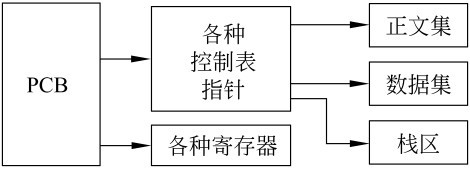

#### 错误是由于两程序共享资源堆栈S导致

3.1.1 小结
==========

- 由于程序的顺序性，静态性以及孤立性，用程序段作为描述其执行过程和共享资源的基本单位是不合适的
- 进程是描述程序的执行过程且能用来共享资源的基本单位

3.1.2 进程的定义
===============

#### 进程的5个定义

- 进程是可以并发执行的计算部分
- 进程是一个独立的可以调度的活动
- 进程是一抽象实体，当它执行某个任务时，将要分配和释放各种资源
- 行为的规则叫程序，程序在处理机上执行时的活动称为进程
- 一个进程是一系列逐一执行的操作，而操作的确切含义则有赖于以何种详尽程序来描述进程

#### 并发执行的程序在执行过程中分配和管理资源的基本单位

3.1.2 进程和程序
===============

#### 既有区别也有联系

- 进程是一个动态概念，而程序是一个静态概念
- 进程具有并发特征，而程序没有。进程具有并发特征的两个方面，即独立性和异步性。
- 进程是竞争计算机系统资源的基本单位
- 不同的进程可以包含同一程序

3.2 进程的描述
==============

- 系统通过进程控制块PCB描述进程存在，并反映其变化的物理实体
- 进程的PCB是系统感知进程的唯一实体
- 进程PCB结构都是全部或部分常驻内存

3.2.1 进程控制块PCB
==================

#### PCB是进程存在和死亡的标志
#### PCB的内容
	
- 描述信息 进程名或进程标识号， 用户名或用户标识号， 家庭关系
- 控制信息 进程当前状态， 进程优先级， 程序开始地址， 各种计时信息， 通信信息
- 资源管理器 内存管理， 对换和覆盖信息 共享程序段，输入输出设备号， 文件系统指针
- CPU现场保护结构

3.2.2 进程上下文
===============

#### 进程上下文实际上是进程执行过程中顺序关联的静态描述。

- 每个进程执行过、执行时的以及待执行的指令和数据
- 在指令寄存器、堆栈、状态字寄存器的内容

#### 上文

已执行过的进程指令和数据在相关寄存器与堆栈中的内容

#### 正文

把正在执行的指令和数据在寄存器与堆栈中的内容

#### 下文

把待执行的指令和数据在寄存器与堆栈的内容

3.2.2 进程上下文（2）
====================

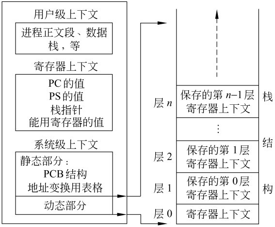

#### 进程的系统级上下文

- 静态部分 PCB结构，地址映射表格，核心栈
- 动态部分 与寄存器上下文相关联

3.2.2 UNIX System V进程上下文
============================

3.2.3 进程上下文切换
==================

#### 上下文切换的三个部分

- 保存被切换进程的正文部分至有关存储区
- 操作系统进程中有关调度和资源分配程序执行
- 被选中进程的原来被保存的正文部分从有关存储区中取出，并送至有关寄存器与堆栈中，激活选中进程执行

#### 上下文切换是一个十分耗时的过程

3.2.4 进程空间与大小
=====================

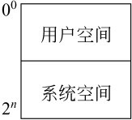 

#### 用户模式与系统模式

3.3 进程状态
=============

进程的5种基本状态：

- 初始态
- 执行态
- 阻塞态（等待状态）
- 就绪态
- 终止态

3.3.2 进程状态的转换
===================

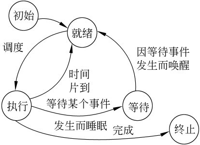 

3.4 进程控制
===========

#### 定义

- 进程控制，就是系统使用一些具有特定功能的程序段来创建、撤销进程以及完成进程各状态间的转换，从而达到多进程高效率并发执行和协调、实现资源共享的目的。

#### 原语

- 不允许中断的指令或程序段
- 原语执行于系统态，用于完成操作系统某些特定功能

3.4.1 进程的创建
==============

#### 进程创建的两种方式

- 由系统程序模块统一创建， 在批处理系统中
- 由父进程创建

3.4.1 进程的撤销
================

#### 进程撤销的3种情况

- 该进程已完成所要求的功能而正常终止
- 由于某种错误导致非正常终止
- 祖先进程要求撤销某个进程

3.4.2 进程的阻塞
===============

3.4.2 进程的唤醒
================

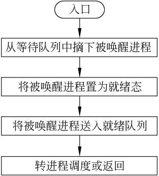

3.5 进程互斥
===========

#### 并发执行受资源有限性制约

- 进程并发特征（独立性和异步性），导致执行随机和提高资源利用率
- 进程执行过程受资源有限约束

#### 资源有限约束

- 临界区 程序在任何时刻可中断；可并发执行的三个条件的检验是不可能的；
- 一个例子
- 概念：把不允许多个并发进程交叉执行的一段程序称为临界部分或临界区
- 临界区由属于不同并发进程的程序段共享公用数据或公用数据变量引起的

3.5.1 临界区的例子
================

 
<% code do  %>

getspace: begin local g
		g ← stack[top]
		top ← top-1
		end

release(ad):begin
		top ← top+1
		stack[top] ← ad
end
<% end %>

3.5.1 间接制约
=============

#### 临界区集合

一般来说，可以把那些不允许交叉执行的临界区按不同的公用数据划分成为不同的集合，把这些集合称为临界区集合。例如上例中，以公用数据栈S划分的临界区集合是{getspace, release}。

#### 临界区的描述

<% code do  %>
when <类名> do <临界区> od
<% end %>

3.5.1 间接制约
=============
#### 例子

<% code do  %>

getspace: when sp do getspace ← stack[top]
		top ← top-1
		od

release(ad):when sp do top ← top+1 
		stack[top] ← ad
		od
<% end %>

#### 由于共享资源不允许并发进程交叉执行，称为间接制约

#### 解决共享资源而引发的间接制约采用， 互斥

3.5.2 互斥
=========

#### 定义

一组并发进程的一个或多个程序段，因共享某一公有资源而导致它们必须以一个不允许交叉执行的单位执行。即，不允许两个以上的共享该资源的并发进程同时进入临界区，称为互斥

#### 互斥执行的四个原则

- 不能假设各个并发进程的相对执行速度
- 进程不能阻止其他进程进入临界区
- 只能允许一个进程进入临界区
- 并发进程应在有限时间内进入临界区

3.5.2 临界区
===========

3.5.2 忙等待的互斥
================

<% code do  %>
lock(x)=begin local x
	repeat
		v ← x
	until v = 1
	x ← 0
<% end %>

<% code do  %>
unlock(x)=begin x←1 end
<% end %>

#### 缺点： 违反了第3原则（为什么）

3.5.2 原始解法
=============

3.5.2 Peterson解法
=================
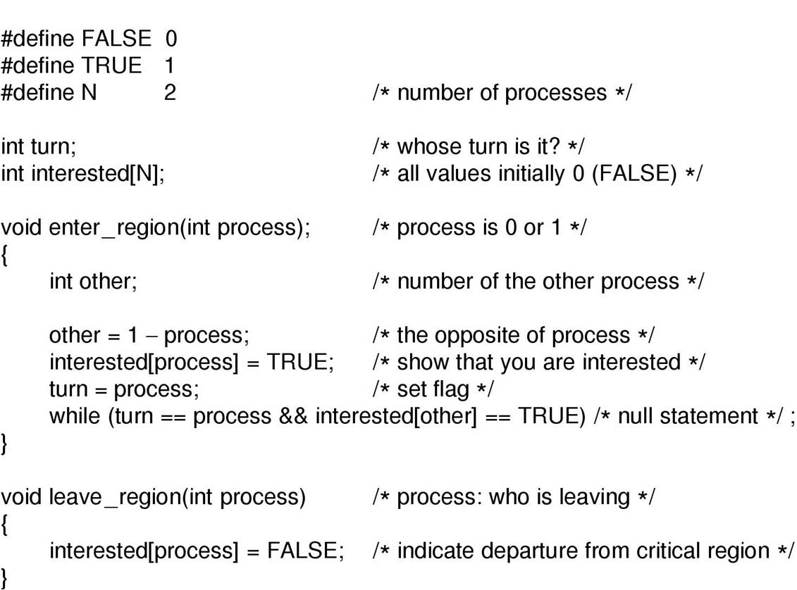

3.5.2 TSL指令
============

3.5.3 生产者和消费者问题
======================

3.5.3 信号量
=============

#### 采用锁机制，会导致严重的性能问题及不公平现象

#### 一个例子

<% code do  %>
PA
	A: lock(key[S])
		<S>
		unlock(key[S])
		Goto A
PB	
	B: lock(key[S])
		<S>
		unlock(key[S])
		Goto B
<% end %>

#### 如何解决不公平问题（引入第三方监督）

3.5.3 信号量（2）
===============

#### 最早由E.W.Dijkstra提出

#### 信号量类似交通信号灯：红灯停，绿灯行

#### 信号量的含义 

- 为一整数
- 大于或等于0时代表可供并发进程使用的资源实体数
- 小于0则表示等待使用临界区的进程数
- 初始值为非负数

3.5.3 PV原语
===============

#### P原语

- SEM减1
- 若SEM减1后仍大于或等于0，则P语言返回，进程继续执行
- 若SEM减1后小于0，进程阻塞

3.5.3 PV原语
===============

3.5.3 PV原语
===============
#### V原语

- SEM加1
- 若相加结果大于0，V原语停止执行，。进程返回调用处
- 若相加结果小于或等于0，则该信号的等待队列中唤醒一个等待进程，返回再返回原进程继续执行或转进程调度

3.5.3 PV原语
===============
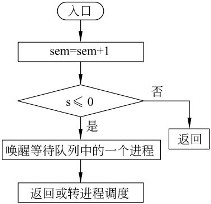

#### PV操作必须采用原语实现

3.5.3 P原语的实现
===================
<% code do  %>
P(sem)
	begin
		封锁中断;
		lock(lockbit);
		val[sem]=val[sem]-1;
		if val[sem]<0
			保护当前进程CPU现场
			当前进程状态置为“等待”
			将当前进程插入信号SEM等待队列
			转进程调度
		fi
		unlock(lockbit):开放中断
	end
<% end %>

3.5.3 V原语的实现
===================
<% code do  %>
P(sem)
	begin
		封锁中断;
		lock(lockbit);
		val[sem]=val[sem]+1;
		if val[sem]≤0
			local k
			从sem等待阶列中选取一等待进程，将其指针置入k中
			将k插入就绪队列
			进程状态置为“就绪"
		fi
		unlock(lockbit):开放中断
	end
<% end %>

3.5.4 用PV原语实现进程互斥
=======================

#### 步骤

- 设SEM为互斥信号量，其取值范围为(1,0,-1)
- 描述进程

<% code do  %>
PA:
	P(SEM)
	<S>
	V(SEM)
	...

PB: 
	P(SEM)
	<S>
	V<SEM>
<% end %>

3.6 进程同步
===========
<% code do  %>
Pc	:
  	:
	A: local Buf
		Repeat
			Buf ← Buf
		Until Buf=空
		计算
		得到计算结果
		Buf ← 计算结果
		Goto A
Pp	:
	:
	B: local Pri
		Repeat
			Pri ← Buf
		Until Pri ≠ 空
		打印Buf中的数据
		清除Buf中的数据
		Goto B	
<% end %>

#### 异步环境下的并发进程，存在CPU时间的极大浪费

3.6 进程同步
===========

#### 进程间的同步

异步环境下的一组并发进程，因直接制约而互相发送消息而进行互相合作、互相等待，使得各进程按一定的速度执行的过程称为进程间的同步。

#### 合作进程

具有同步关系的一组并发进程称为合作进程

#### 消息或事件

合作进程间互相发送的信号称为消息或事件

3.6 进程同步
===========

#### 利用消息实现进程间同步
<% code do  %>
Pc	:
	A: wait(Bufempty)
		计算
		Buf ← 计算结果
		Bufempty ← false
		signal(Buffull)
		Goto A
Pp	:
	B: wait(Buffull)
		打印Buf中的数据
		清除Buf中的数据
		Buffull ← false
		signal(Bufempty)
		Goto B
<% end %>

#### 消息原语

- wait: 等待到消息名为true的进程继续执行
- signal: 向合作进程发送所需要的消息名，并置消息为true

3.6.2 私用信号量
===============

用于进程间同步的信号量一般称为私用信号量。一个进程的私用信号量是从制约进程发送来的进程Pi的执行条件所需要的消息。与私用信号量对应，互斥时使用的信号量为公用信号量。

3.6.3  用P,V原语操作实现同步
==========================

#### 三步曲

- 为**各**并发进程设置私用信号量
- 为私用信号量赋初值
- 利用P,V原语和私用信号量规定各进程的执行顺序

3.6.3  用P,V原语操作实现同步
==========================

#### 解决方案

- 设PA的私用信号量为Bufempty, 设PB的私用信号量为Buffull
- 令Bufempty ← n (n为缓冲队列的缓冲区个数）,Bufful的初始值为0
- 描述 ：

<% code do  %>
PA: deposit(data):
	begin local x
		P(Bufempty)
		按FIFO方式选择一个空缓冲区Buf(x);
		Buf(x) ← dat
		Buf(x)置满标记
		V(Buffull)
	end

PB:	remove(data):
	begin local x
		P(Buffull);
		按FIFO方式选择一个装满数据的缓冲区Buf(x)
		data ← Buf(x)
		Buf(x)置空标记
		V(Bufempty)
	end
<% end %>

3.6.4 生产者消费者问题
====================
#### 生产者与消费者问题

- 消息者想接收数据时，有界缓冲区至少有一个单元是满的
- 生产者想发送数据时，有界缓冲区至少有一个单元是空的

3.6.4 生产者消费者信号量解法
==========================

<% code do  %>
sim mutex ← 1;
sim avail ← n;
sim full ← 0;
deposit(data):
	begin
		P(avail)
		P(mutex)
		送数据入缓冲区某单元
		V(full)
		V(mutex)
	end

remove(data):
	begin
		P(full)
		P(mutex)
		取缓冲区中某单元数据
		V(avail)
		V(mutex)
	end
<% end %>

#### 由于V原语是释放资源的，所以可以以任意次序出现。但P原语则不然，如果次序混乱，将会造成进程之间的死锁。

补充资源-前趋图
=============

#### 为了描述一个程序的各部分（程序段或语句）间的依赖关系，或者是一个大的计算的各个子任务间的因果关系，我们常常采用前趋图方式。

#### 前趋图中的每个结点可以表示一条语句、一个程序段或一个进程，结点间的有向边表示两个结点之间存

#### 前趋图是一种偏序关系（自反，反对称，传递）

#### 如果（Pi，Pj）∈→，可写成Pi→Pj，Pi是Pj的直接前趋，Pj是Pi的直接后继

补充资源-前趋图
=============
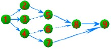

#### 该前趋图，存在下面的前趋关系：
	P1→P2，P1→P3，P1→P4，P2→P5，P3→P5，
　　P4→P6，P4→P7，P5→P8，P6→P8，P7→P9，P8→P9；

补充资源-前趋图
=============

#### 画出以下语句的前趋图
	
<% code do  %>
	s1:  a:=x+y
	s2:  b:=a-5 
	s3:  c:=b+1     
<% end %>
#### Ex2

<% code do  %>
	S1： a:=x+2
    S2:  b:=y+4
    S3:  c:=a+b
    S4:  d:=c+6
<% end %>

补充资源-前趋图
=============

进程 P1、P2、P3 和 P4 的前趋图如下： 若用 PV 操作控制这几个进程并发执行的过程，则需要设置 4 个信号量 S1、S2、S3 和 S4。且信号量初值都等于零，图中 a 和 b 应分别填写（1），c 和 d 应分别填写（2）。

补充资源-前趋图
=============

补充资源-前趋图
=============
(1)
1. P(S1) P(S2)和 P(S3) 

2. P(S1) P(S2)和 V(S1) 

3. V(S1) VS2)和 P(S1) 

4. V(S1) V(S2)和 V(S3) 

(3)
1. P(S1) P(S2)和 P(S4) 

2. P(S2) P(S3)和 P(S4) 

3. V(S1) V(S2)和 V(S4) 

4. V(S2) V(S3)和 V(S4)

哲学家问题
===========

#### 描述

- 有5位哲学家围坐在一张圆桌旁，桌子中央放有一盘通心面，每人面前有一只盘子，每两人之间放一把叉子；每位哲学家思考、饥饿，然后吃通心面；为了吃面，哲学家必须获得两把叉子，且每人只能直接从紧领自己的左边或右边去取叉子

哲学家问题
===========	

哲学家问题
===========

#### 读题

- 每把叉子必须互斥使用。

#### 解法
	<% code do  %>
	sim fork[5];
	i ← 0;
	while i<5 do
		fork[i] ← 1;
	od
	philosopher_i():
		begin 
			while True do
				think();
				P(fork[i]);
				P(fork[(i+1)%5]);
				eat();
				V(fork[i]);
				V(fork[(i+1)%5]);
			od
		end
		
	<% end %>

哲学家问题
===========

#### 解法

<% code do  %>
#define N 5
#define LEFT (i+N-1)%N
#define RIGHT (i+1)%N
#define THINKING 0
#define HUNGRY 1
#define EATING 2
typedef int semaphore;
int state[N];
semaphore mutex=1;
semaphore s[N];

void philosopher(int i)
{
	while(TRUE){
		think();
		take_forks(i);
		eat();
		put_forks(i);
	}
}
<% end %>

哲学家问题
===========

#### 解法

<% code do  %>
void tack_forks(int i)
{
	P(mutex);
	state[i] = HUNGRY;
	test(i);
	V(mutex);
	V(s[i])
}
void put_forks(i)
{
	P(mutex);
	state[i] = THINKING;
	test[LEFT];
	test[RIGHT];
	V(mutex);
}
<% end %>

哲学家问题
===========

#### 解法

<% code do  %>
void test(i)
{
	if (state[i]==HUNGRY && state[LEFT] != EATING 
			&& state[RIGHT] != EATING){
		state[i] = EATING;
		V(s[i]);
	}
}
<% end %>

解法的潜在问题
===========

1. 至多允许4位哲学家同时吃面
2. 奇数号哲学家先取左边的叉子，然后再取右边的叉子。偶数号哲学家先取右边的叉子，然后再取左边的叉子
3. 每位哲学家取到手边的两把叉子才开始吃面，否则连一把叉子也不取

读者-写者问题
===========

#### 描述 

- 读者写者问题是一个经典的并发程序设计问题，（1971年，Courtois, Heymans, Parnas），有两组并发进程 ：读者和写者，共享文件F

#### 要求

1 允许多个读者同时对文件执行读操作

2 只允许一个写者对文件执行写操作

3 任何写者在完成写操作前不允许其他读者或写者工作

4 写者在执行写操作前，应让已有的写者和读者全部退出

读者和写者的解法
==============

<% code do  %>
int readcount ← 0;
sim writeblock ← 1;
sim mutex ← 1;

reader():
	begin
		P(mutex)
		readcount ← readcount+1
		if readcount == 1:
			P(writeblock)
		fi
		V(mutex)
		{读文件}
		P(mutex)
		readcount ← readcount-1
		if readcount == 0:
			V(writeblock)
		fi
		V(mutex)
	end
<% end %>

读者和写者的解法
==============

<% code do  %>

writer():
	begin
		P(writeblock)
		{写文件}
		V(writeblock)
	end
<% end %>

理发师问题
=========

#### 描述

- 理发店里有一位理发师，一把理发椅和n把供等候理发的顾客休憩的椅子；如果没有顾客，理发师便在理发椅上睡觉，当有顾客到来时，他唤醒理发师；如果理发师正在理发时又有新的顾客来到，那么如果还有空椅子，顾客就坐下来等待，否则离开理发店

理发师问题
=========

#### 解法

<% code do  %>
	int waiting=0;
	int CHAIRS =N;
	semaphore customers, barbers, mutex;
	customer=0; barbers=0; mutex=1;
	barber():
		begin
			while True do
				P(customer);
				P(mutex);
				waiting--;
				V(barbers);
				V(mutex);
				cut_hari();
			od
		end

<% end %>

理发师问题
=========

#### 解法

<% code do  %>

	customer_i():
		begin
			P(mutex)
			if waiting < CHAIRS:
				waiting ← waiting + 1;
				V(customers);
				V(mutex);
				P(barbers);
				get_haircut();
			else
				V(mutex)
			fi	

		end
<% end %>

3.7 进程通信
===========

#### 根据内容划分

- 控制信息的传送：低级通信，目的控制进程执行速度 
- 大批量数据传送：高级通信，目的传送大量信息，实现交换信息

#### 进程的通信方式

- 主从式
- 会话式
- 消息或邮箱机制
- 共享存储区方式

3.7.2 消息缓冲机制
===================
<% code do  %>
send(m):
	begin
		向系统申请一个消息缓冲区
		P(mutex)
		将发送区消息m送入新申请的消息缓冲区
		把消息缓冲区挂入接收进程的消息队列
		V(mutex)
		V(SM)
	end

receive(n):
	beign:
		P(SM)
		P(mutex)
		摘下消息列队中的消息n
		将消息n从缓冲区复制到接收区
		释放缓冲区
		V(mutex)
	end
<% end %>

3.7.3 邮箱通信
==============

3.7.3 邮箱通信
=================

邮箱通信的特点已经在前面介绍过，对于只有一发送进程和一接收进程使用的邮箱同，进程间的通信应该满足如下条件：

- 发送进程发送消息时，邮箱中至少要有一个空格能存放该消息
- 接收进程接收消息时，邮箱中至少要有一个消息存在

<% code do  %>
deposit(m):
	begin local x
		P(fromnum)
		选择空格x
		将消息m放入空格x中
		置x的标志为满
		V(mesnum)
	end

remove(m):
	beign local x
		P(mesnum)
		选择满格x
		把满格x中的消息取出放在m中
		置格x标志为空
		V(fromnum)
	end
<% end %>

3.7.3 和控制台通信
==============

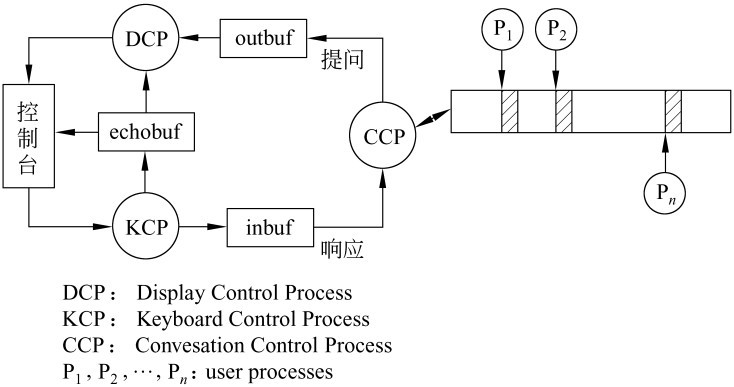

3.7.3 CCP和用户进程的接口
==============

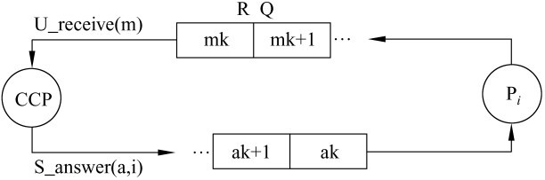

3.7.管道
==============

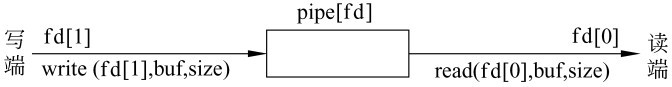

3.7.管道
==============

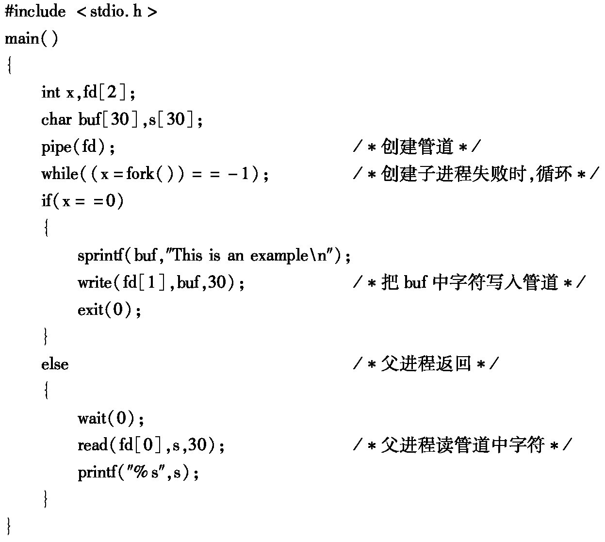

3.7.管道
==============

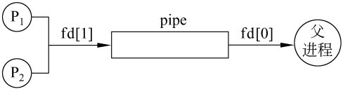

3.8 死锁问题
============

#### 资源

- 一些独占性资源：打印机，磁带，系统内部表中的表项。
- 进程需要一个合理的顺序去访问资源
- 假设一个进程拥有资源A并请求资源B,同时另一个进程拥有B并请求A，两个进程都被阻塞，并且一直处于这样的状态

3.8 可抢占与不可抢占资源
======================

#### 死锁有可能出现，当....

- 进程对设备、文件等取得了排他性访问权
- 我们把这类需要排他性使用的对象称为资源(resources)

#### 可抢占资源

- 可以从拥有它的进程中抢占而不会产生任何副作用

#### 不可抢占资源

- 指在不引相关的计算失败的情况下，无法把它从占有它的进程处抢占过来

3.8 一个例子
======================

